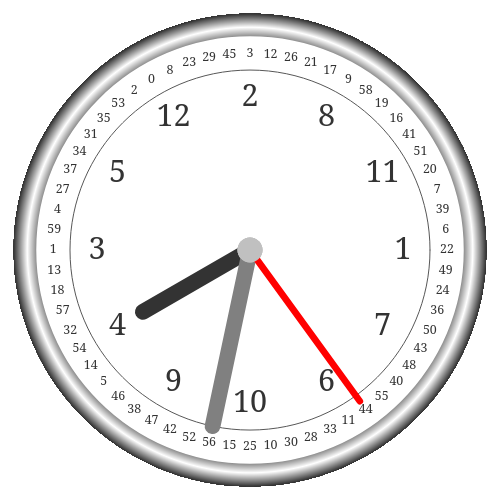
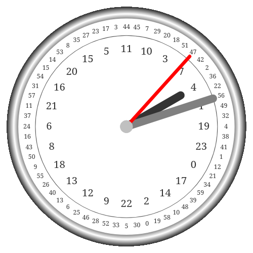

# Unreadable Clocks

A random idea a friend came up with to create a clock which displayed the hours and minutes in a jumbled format. These both work as real clocks... if you can read them. Both clocks can be seen working at the link below.

https://nathan-cav.github.io/unreadable-clocks/

# 12 Hour Clock

Clock displaying the time in the 12-hour format.

# 24 Hour Clock

Clock displaying the time in the 24-hour format.

